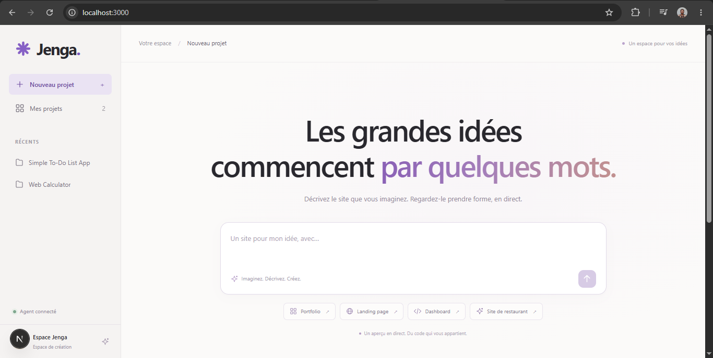
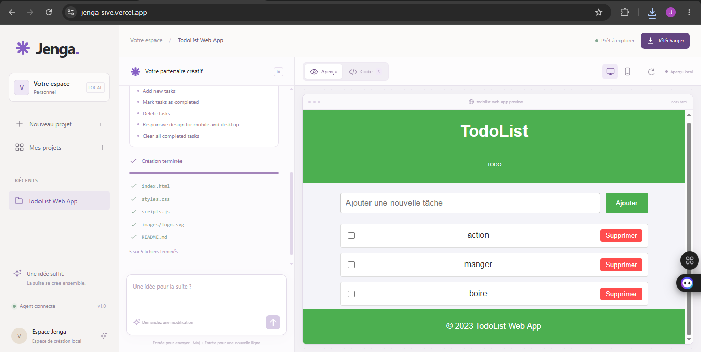

# Jenga

Jenga is an AI-powered website generator with live preview.

Describe the website you want to build, and Jenga plans the structure, writes the files, and updates the preview while the project is being generated.

It uses:

- **Next.js** for the frontend
- **FastAPI** for the backend API
- **LangGraph** to orchestrate the AI agents
- **Server-Sent Events (SSE)** for real-time generation updates

## Preview

### Homepage



### Website generation



## Features

- Generate websites from a simple prompt
- Live preview while files are being created
- Switch between **Preview** and **Code**
- Desktop and mobile preview modes
- Continue editing an existing project through conversation
- Stop an active generation
- Reopen recent projects
- Download generated files as a ZIP archive
- Keep the conversation and project files together

Generated websites currently use standard **HTML, CSS, and JavaScript**, which makes it possible to preview them immediately without starting another development server.

## Getting Started

### Requirements

- Python 3.11+
- Node.js 20.9+

Clone the repository and install the backend dependencies.

On Windows PowerShell:

```powershell
python -m venv backend/.venv

backend/.venv/Scripts/python.exe -m pip install -r backend/requirements.txt
```

If `backend/.env` does not exist yet:

```powershell
Copy-Item backend/.env.example backend/.env
```

Add your OpenAI API key:

```env
OPENAI_API_KEY=your_key_here
```

You can also change the model:

```env
OPENAI_MODEL=gpt-4o
```

Start the backend:

```powershell
backend/.venv/Scripts/python.exe -m uvicorn backend.main:app --reload --host 127.0.0.1 --port 8000
```

On macOS or Linux, use:

```bash
backend/.venv/bin/python
```

## Frontend

Open another terminal:

```bash
cd frontend
npm install
npm run dev
```

Then open:

```text
http://localhost:3000
```

FastAPI documentation is available at:

```text
http://127.0.0.1:8000/docs
```

## Configuration

By default, the Next.js frontend connects to:

```text
http://127.0.0.1:8000
```

To use another backend URL, create:

```text
frontend/.env.local
```

You can copy the example file:

```bash
cp frontend/.env.example frontend/.env.local
```

Then configure:

```env
BACKEND_URL=http://127.0.0.1:8000
```

The OpenAI API key stays on the backend and is never exposed to the browser.

## How It Works

Jenga uses a multi-step agent workflow:

```text
Prompt
  ↓
Planner
  ↓
Architect
  ↓
Coder
  ↓
Generated Files
  ↓
Live Preview
```

The backend streams progress to the frontend using **Server-Sent Events**.

This allows the interface to display generation stages, file updates, and the website preview before the full generation is complete.

## Generated Projects

In local development, generated projects are stored inside:

```text
generated_projects/<project_id>/
```

Each project keeps its generated files and conversation history.

This makes it possible to reopen a project and ask Jenga to modify it instead of starting from scratch.

## Deployment on Vercel

When running on Vercel, the backend automatically uses:

```text
/tmp/jenga/generated_projects/
```

This storage is temporary.

Projects may disappear when an instance restarts, and another request may be handled by a different instance.

For production or multi-user deployments, use persistent shared storage.

You can configure another writable directory with:

```env
PROJECTS_DIR=/absolute/path/to/projects
```

## API

Main endpoints:

| Route | Description |
|---|---|
| `GET /api/health` | Check API availability |
| `POST /api/generate` | Start or continue a generation |
| `GET /api/projects/{uuid}` | Load a saved project |
| `GET /api/projects/{uuid}/download` | Download a project as ZIP |

Example generation request:

```json
{
  "prompt": "Create a modern landing page for a SaaS product",
  "project_id": null
}
```

To continue an existing project, send its `project_id` with the new prompt.

## Streaming Events

During generation, the API can emit events such as:

- `start`
- `stage`
- `plan`
- `tasks`
- `file_delta`
- `file`
- `task_done`
- `done`
- `error`

These events are used by the frontend to update the interface in real time.

## Running Tests

Backend:

```powershell
backend/.venv/Scripts/python.exe -m unittest discover -s backend/tests -v
```

Frontend:

```bash
cd frontend

npm run lint
npm run build

npx playwright install chromium
npm run test:e2e
```

The browser tests use a deterministic backend and do not make paid model requests.

## Project Structure

```text
backend/
├── agent/
│   ├── graph.py
│   └── workspace.py
├── main.py
└── streaming.py

frontend/
├── app/
├── components/
├── lib/
└── public/

screenshots/
├── home.png
└── generation.png
```

Main files:

- `backend/agent/graph.py` — agent workflow
- `backend/agent/workspace.py` — project file workspace
- `backend/main.py` — FastAPI application
- `backend/streaming.py` — streaming helpers
- `frontend/components/builder.tsx` — main builder interface
- `frontend/lib/use-builder.ts` — generation state
- `frontend/lib/preview.ts` — isolated live preview
- `frontend/app/api/[...path]/route.ts` — proxy to FastAPI

## Current Limitations

Jenga is currently designed mainly for local development.

At the moment:

- generated websites use HTML, CSS, and JavaScript
- the preview cannot run a generated backend
- Vercel `/tmp` storage is not persistent
- authentication is not implemented yet
- generation locks are stored in memory
- generated React or Next.js projects are not executed directly

Supporting generated React or Next.js applications will require an isolated environment capable of installing dependencies, building the project, and running a development server safely.

## Contributing

Contributions are welcome.

To contribute:

1. Fork the repository.
2. Create a branch.

```bash
git checkout -b feature/my-feature
```

3. Make your changes.
4. Add or update tests when necessary.
5. Open a Pull Request.

For bugs, feature requests, or ideas, feel free to open an Issue.

## Roadmap

Some ideas for future versions:

- React and Next.js project generation
- persistent project storage
- authentication
- cloud project management
- project version history
- improved agent tooling
- one-click deployment
- better preview environments

## License

Add the license used by the project here.

For example:

```text
MIT License
```

---

Built with Next.js, FastAPI, and LangGraph.